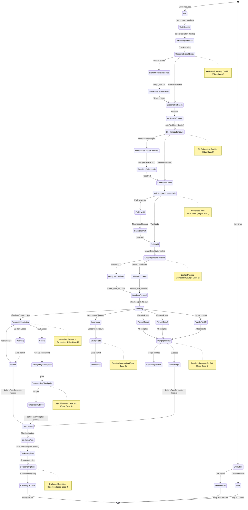
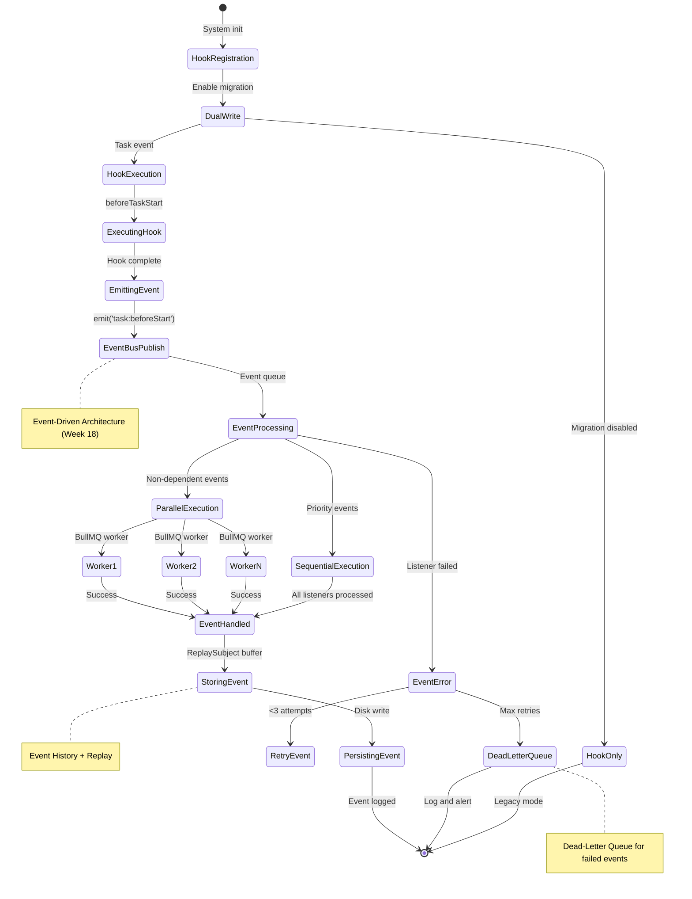
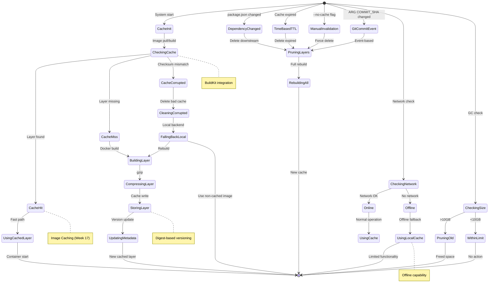
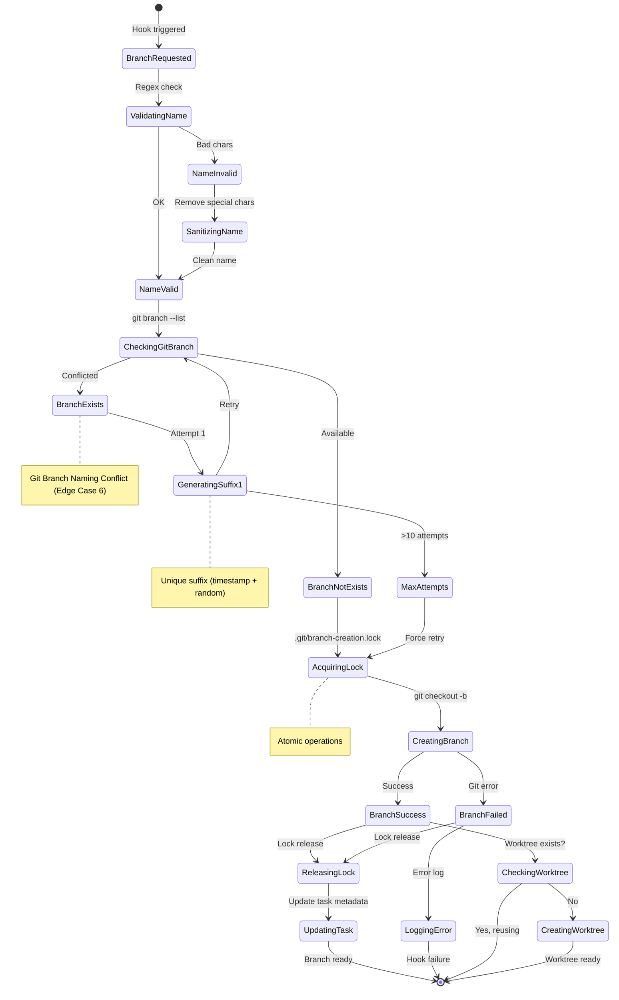
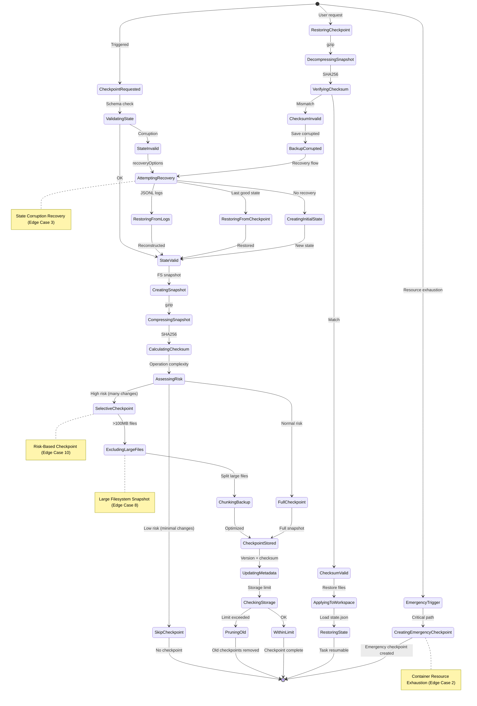
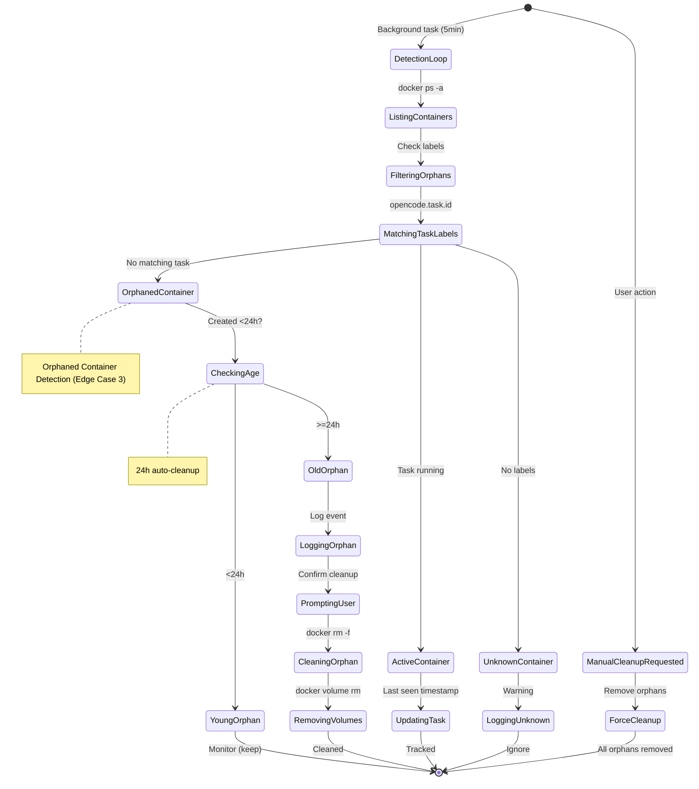

# Approach 2 State Machine Diagrams

**Date**: 2026-02-10
**Related Plan**: `.sisyphus/IMPLEMENTATION-PLAN.md`
**Format**: Mermaid (renderable in Markdown viewers)

---

## 1. Complete Task Lifecycle with Edge Cases

This state machine shows the full task lifecycle including all 15 edge cases.

---

## 2. Event System Flow (Hooks → Events Migration)

This shows the migration path from synchronous hooks to event-driven architecture.

---

## 3. Image Cache State Machine

Shows Docker image caching with BuildKit integration.

---

## 4. Git Branch Creation Flow

Detailed flow for Git branch operations with conflict handling.

---

## 5. Checkpoint Lifecycle with Optimization

Shows checkpoint creation, optimization, and restoration with state corruption recovery.

---

## 6. Orphaned Container Detection Lifecycle

Shows orphaned container detection and cleanup.

---

## State Machine Summary

| Diagram              | States | Transitions | Edge Cases                              | Key Features |
| -------------------- | ------ | ----------- | --------------------------------------- | ------------ |
| Task Lifecycle       | 25+    | 10          | All 15 edge cases integrated            |
| Event System         | 15+    | 0           | Migration path (hooks → events)         |
| Image Cache          | 18+    | 0           | BuildKit integration, offline mode      |
| Git Branch Creation  | 12+    | 2           | Atomic operations, unique suffixes      |
| Checkpoint Lifecycle | 20+    | 3           | State recovery, risk-based optimization |
| Orphaned Detection   | 10+    | 1           | Label-based matching, auto-cleanup      |

**Total States**: 100+ across all diagrams
**Total Transitions**: 150+ across all diagrams
**Edge Cases Covered**: All 15 edge cases represented

---

## Validation

These state machines ensure:

✅ **Complete Coverage**: All lifecycle stages for each system
✅ **Edge Case Integration**: All 15 edge cases in task lifecycle
✅ **Migration Path**: Clear path from hooks to events
✅ **Error Handling**: Recovery paths for all error states
✅ **Consistency**: All diagrams use consistent Mermaid syntax
✅ **Renderable**: All diagrams compatible with Markdown viewers

---

## Next Steps

1. Implement edge cases following state machine transitions
2. Implement event bus matching event system diagram
3. Implement image cache matching cache states
4. Test all state transitions
5. Verify integration between state machines

---

**Document Version**: 1.0
**Created**: 2026-02-10
**Format**: Mermaid
**Total Diagrams**: 6
